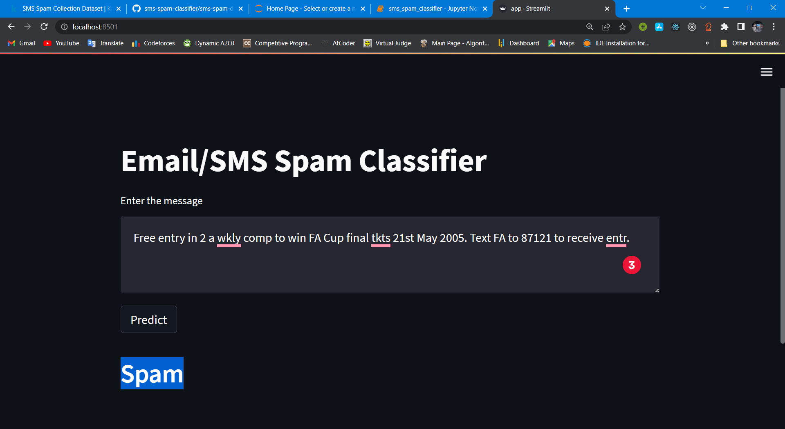

<html>

<body>
<h1>Email/Sms Spam Detector</h1>

Online Social Networks are perpetually evolving and used in plenteous applications such as content sharing, chatting, making friends/followers, customer engagements, commercials, product reviews/promotions, online games, and news, etc. The substantial issues related to the colossal flood of social spam in social media are polarizing sentiments, impacting users’ online interaction time, degrading available information quality, network bandwidth, computing power, and speed. Simultaneously, groups of coordinated automated accounts/bots often use social networking sites to spread spam, rumors, bogus reviews, and fake news for targeted users or mass communication. The latest developments in the form of artificial intelligence-enabled Deepfakes have exacerbated these issues at large.Consequently, it becomes extremely relevant to review recent work concerning social spam and spammer detection to counter this issue and its effect.This project is for detecting sms or email spam.

<h1>Libraries Used: </h1>
<ul>
<li>Numpy</li>
<li>Pandas</li>
<li>Matplotlib</li>
<li>Seaborn</li>
<li>Sklearn</li>
<li>Pickle</li>
</ul>
<h1><b>WorkFlow</b></h1>

<ol>
<li>SMS Spam Ham Data Collection</li>
<li>Exploratory Data Analysis</li>
<li>Data Cleaning</li>
<li>Data Preprocessing</li>
<li>Model Building</li>
<li>XG Boost Regressor</li>
<li>Evaluation</li>
</ol>

<video width="320" height="240" controls src="./files/smsSpamDetector.mp4">
  <source src="./files/smsSpamDetector.mp4" type="video/mp4">
Video: 
</video>
<a href="https://smsemailspamdetector.herokuapp.com/">Livelink</a>
<a href="https://www.kaggle.com/datasets/uciml/sms-spam-collection-dataset">Dataset</a>
</body>

</html>
